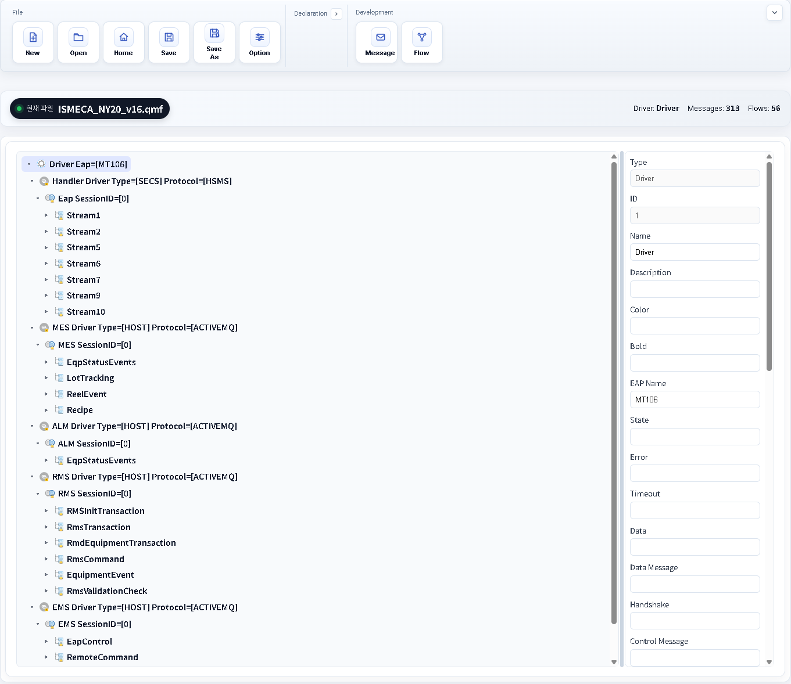

# LinkOn.Modeler.Web

LinkOn.Modeler.Web is a browser-based QMF modeling editor designed to be compatible with existing LinkOn `.qmf` files used by the .NET modeler.

This project focuses on front-end modeling workflows only. No backend service is required.
It targets equipment IoT interface development where `.qmf` files define message contracts and operation flows.

## What a QMF File Represents

A QMF (QubeX Modeling File) is a modeling artifact that defines equipment IoT interface behavior, including:

- Interface message structures and message properties
- Operation/logic flow definitions
- Object relationships used by LinkOn-compatible drivers and tooling

In short, QMF is the core file format for configuring how equipment-side and host-side IoT interfaces exchange and process messages in production IoT systems.

## What This Project Does

- Open, edit, and save QMF files directly in the browser.
- Preserve QMF XML structure and attribute mappings for compatibility with the existing LinkOn ecosystem.
- Provide a ribbon-based UI with dedicated editors for:
  - Message modeling (TreeView + Property Grid)
  - Flow modeling (TreeView + React Flow diagram)
- Apply object-specific text/icon rules and metadata-driven property editing.

## Scope

- Included: modeling-file editing features needed for Message/Flow development.
- Excluded: runtime simulation, equipment communication, and backend integration.

## IoT Development Focus

This web modeler supports practical IoT interface development tasks such as:

- Designing and maintaining message schemas for equipment integration
- Defining operation flows for message handling and sequencing
- Managing model compatibility with existing LinkOn .NET environments
- Accelerating iterative development by editing QMF files directly in the browser

## Tech Stack

- React + TypeScript + Vite
- fast-xml-parser (QMF XML parsing/building)
- reactflow (flow diagram rendering)
- react-split (resizable editor panes)

## Development

```bash
npm install
npm run dev
```

## Production Build

```bash
npm run build
```

## Utility Script

```bash
npm run schema:extract
```

This script regenerates schema metadata from the original modeler sources.

## UI Snapshot


